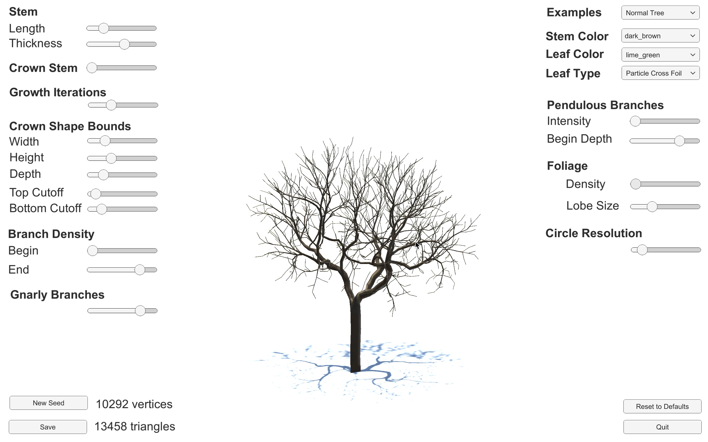
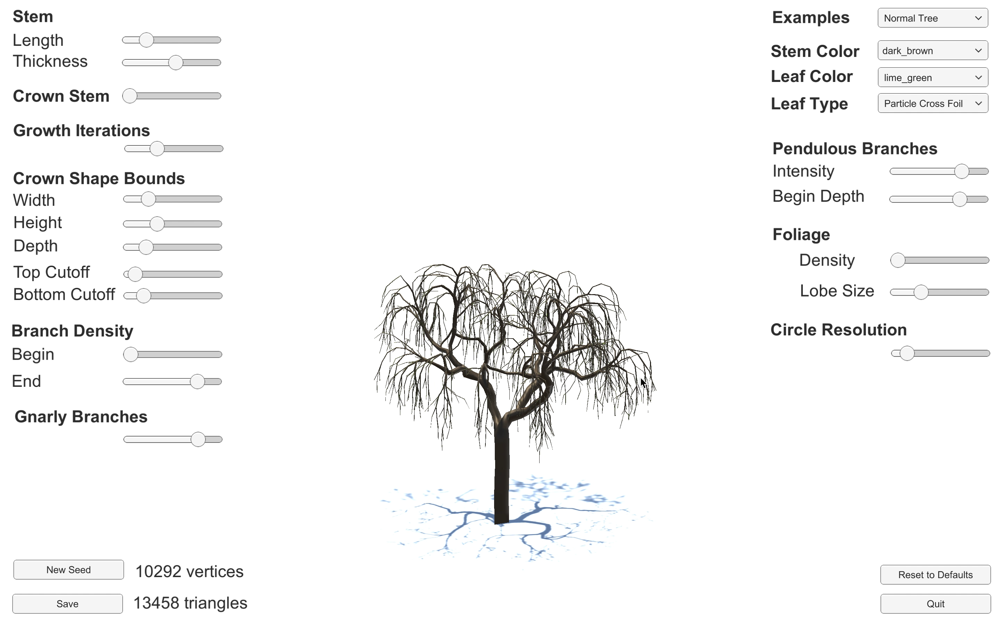
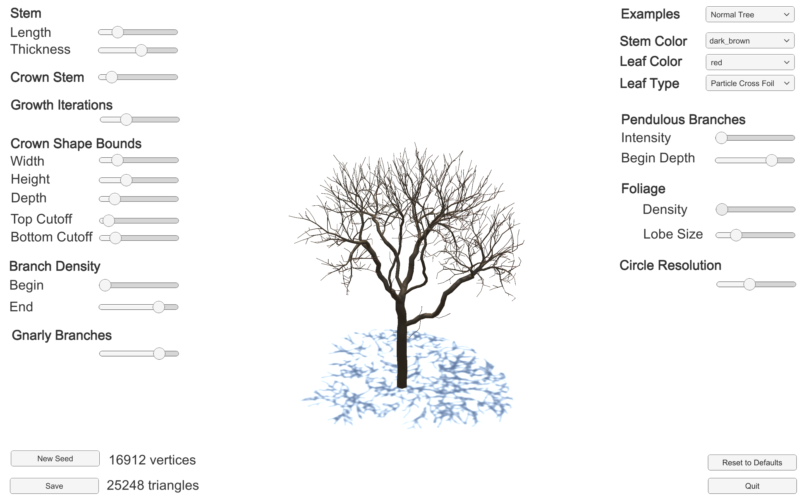
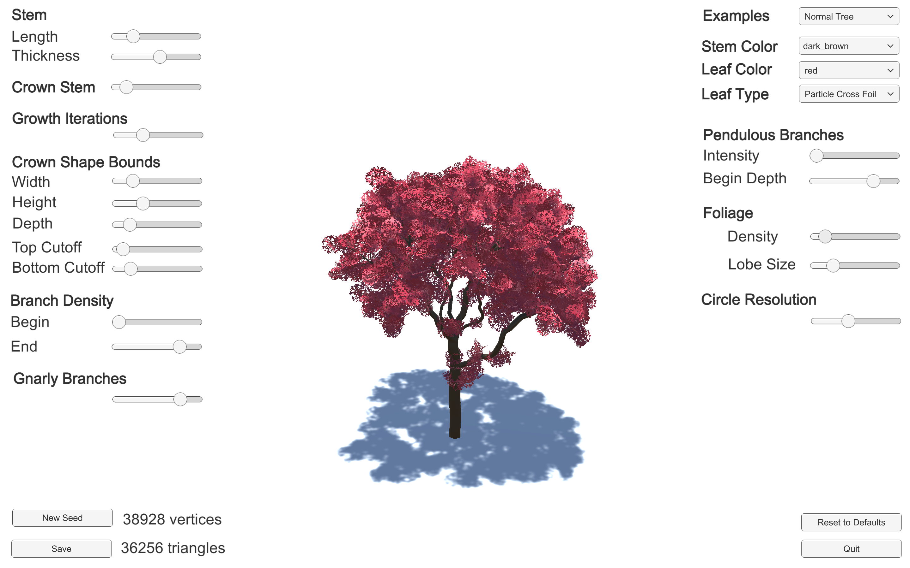
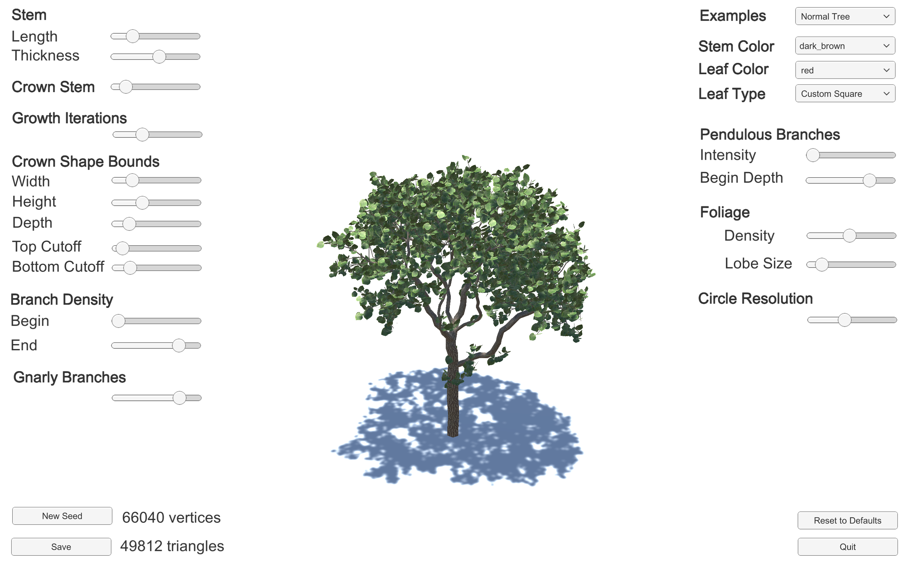
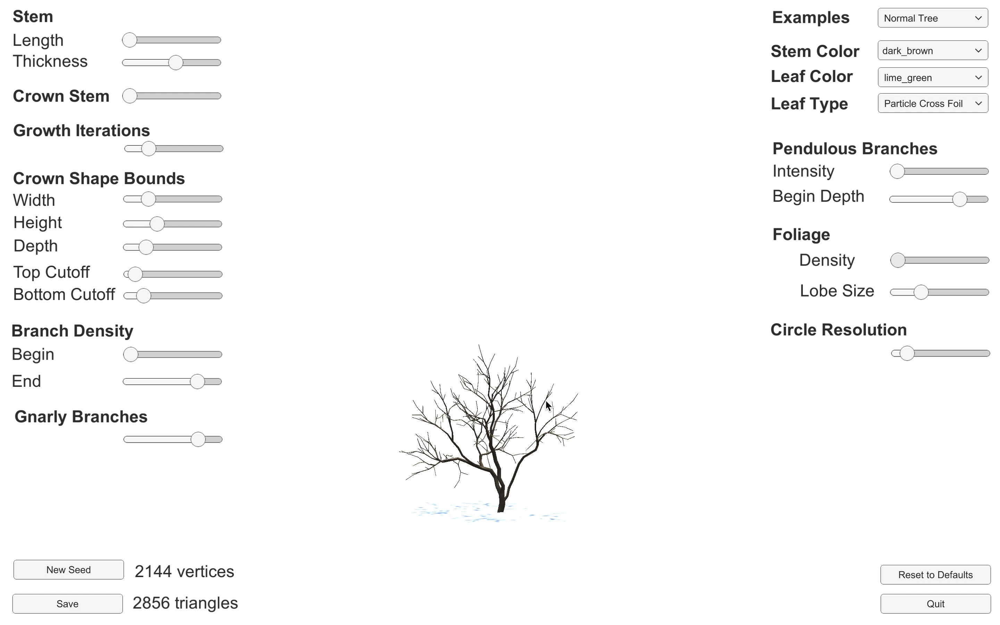
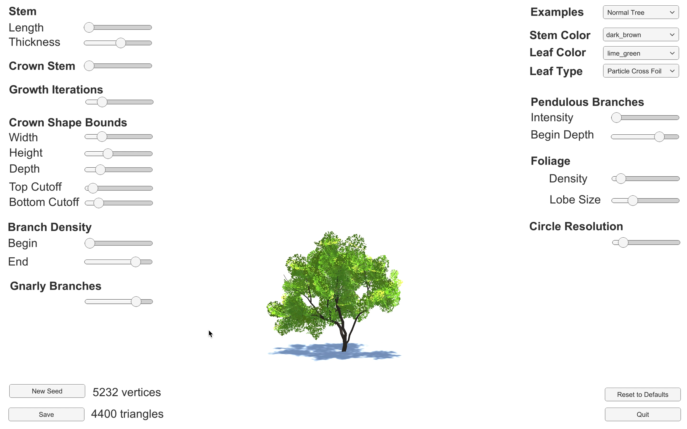
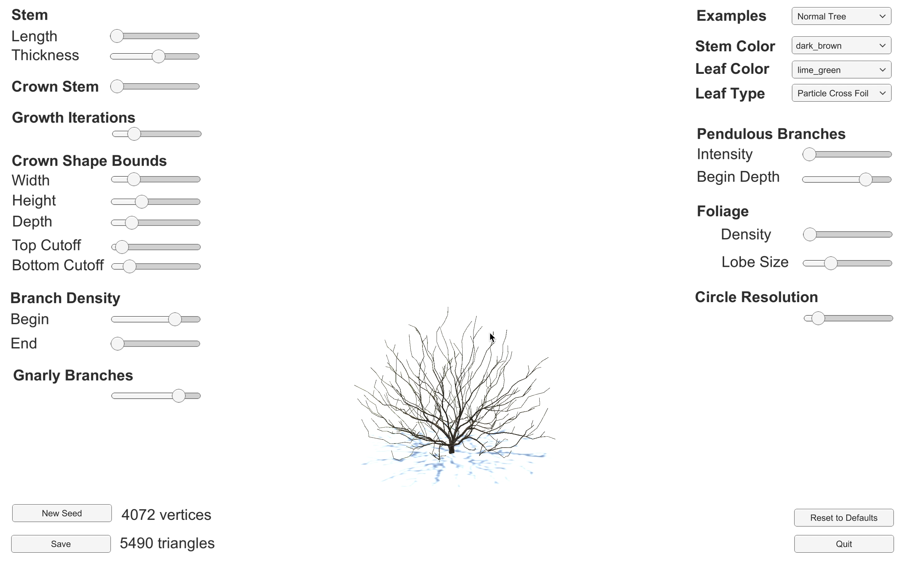
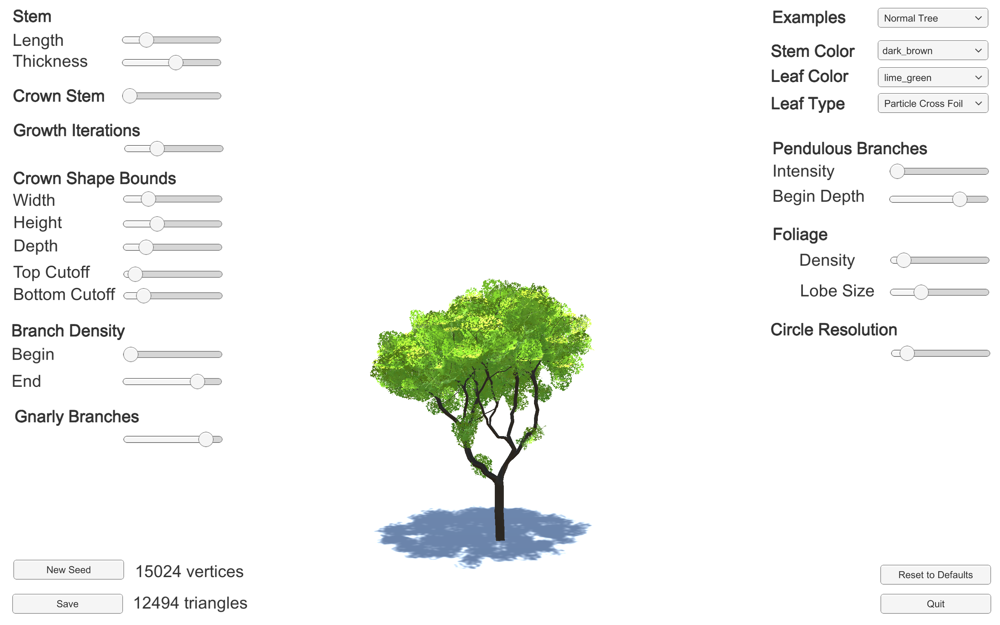
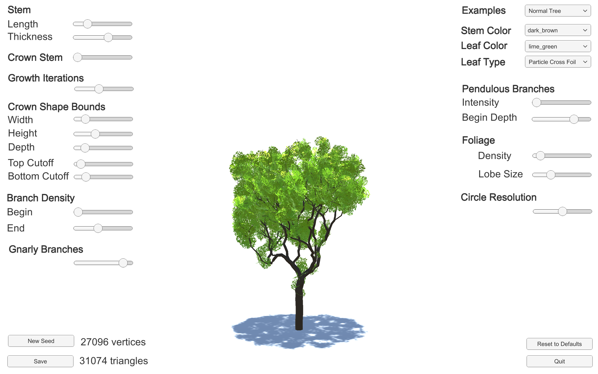

# InfinityTrees
This application came to life as my bachelor thesis. The goal was to provide a reduced user interface complexity compared to other modeling tools. To achieve that, growth simulation algorithms are used in place of the often found component based (graph based) modeling. The resulting software shows that there is potential for the future, further research needs to be done though. Details in german are found in the file "Interaktive Pflanzenmodellierung.pdf". Some example plants are displayed in the following:

